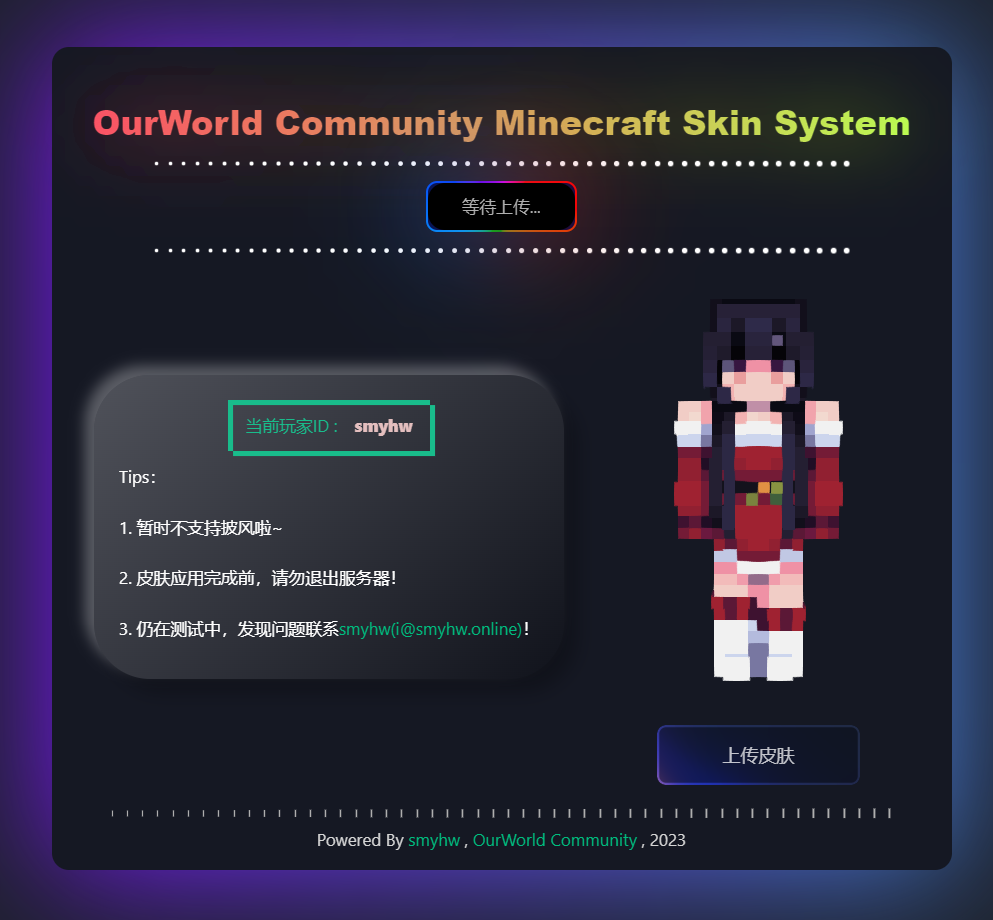
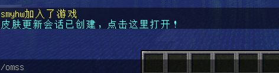

# Ourworld Minecraft Skin System
> 又一个离线服务器的皮肤解决方案

# 特性
* 集成web界面
* 无需额外的账户系统
* 基于[SkinsRestorerX](https://github.com/SkinsRestorer/)

# 预览


## 在此之前
* 目前仅支持velocity
* 没有集成https

# 起步
1. 下载本插件和[SkinsRestorerX](https://github.com/SkinsRestorer/)
2. 放进plugins目录并启动服务器
3. 编辑配置文件，位于`./plugins/omss/config.properties`
4. 为玩家配置`omss.use`权限节点以使用指令

# 配置
目前来说只有两行有效配置
```
http_port=8880
public_prefix=http://localhost:8880/
```
`http_port`指定我们应监听哪个端口来提供http服务  
`public_prefix`则指定在游戏内发送给玩家的链接地址前缀

# 教程
1. 玩家在服务器中使用`/omss`指令，将生成可点击链接
2. 点击后唤起浏览器跳转至web页面上传皮肤
3. 完事啦




# TODO
* 支持bukkit和BC端

# 接口定义

GET /api/session?session=<会话ID>
获取会话ID的状态
返回:
```
{
    "PlayerId": "smyhw"
    "Status": 1
}
```
Status的定义如下:
* 1 = 等待玩家上传皮肤文件
* 2 = 皮肤文件已上传，等待皮肤更改完成
* 3 = 皮肤更改已经完成，前端标签页应主动关闭
* -1 = session不存在(无效)
> 注意：Status为-1时，不存在PlayerId节点


GET /api/skin_file/get/<会话ID>.png
获取指定会话ID上传的图片

返回：
若请求正确，则直接返回图片文件
若发生错误:
```
{
    "Status": -4
}
```
Status的定义如下:
* -4 = 会话ID无效
* -7 = 指定的会话ID还没有上传皮肤文件

POST /api/skin_file/set?session=<会话ID>
皮肤文件上传接口
返回:
```
{
    "Status": 1
}
```

Status的定义如下:
* 1 = 一切正常，皮肤应用已经完成
* -8 = session不存在(无效),可能是玩家在服务器中离线了
* -10 = MineSkin错误
* -11 = DataRequest错误


GET /*
最后默认路由，匹配并返回前端静态资源